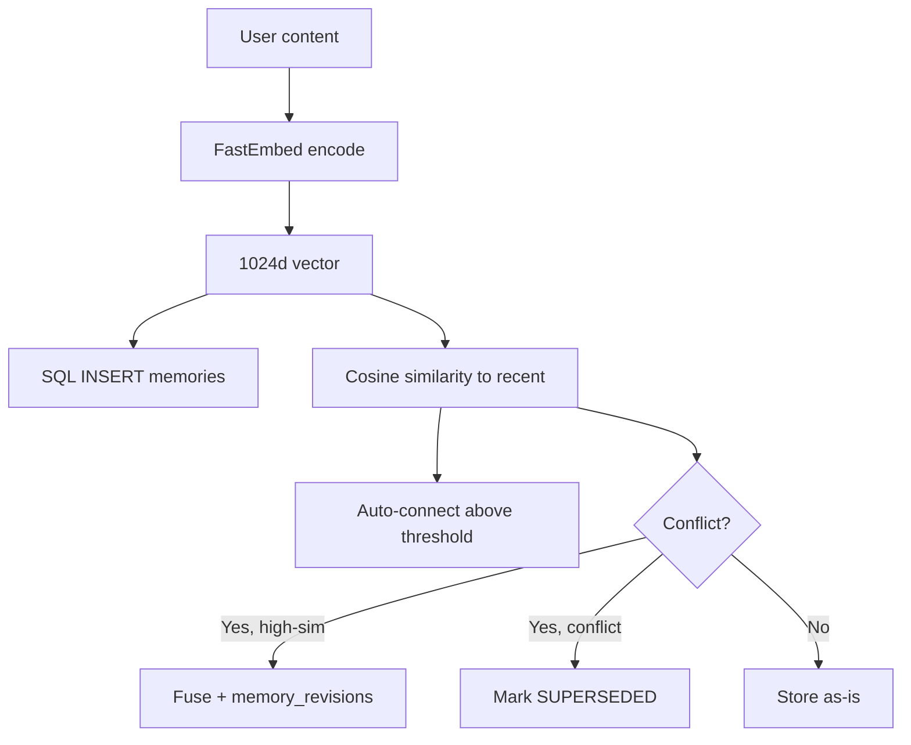
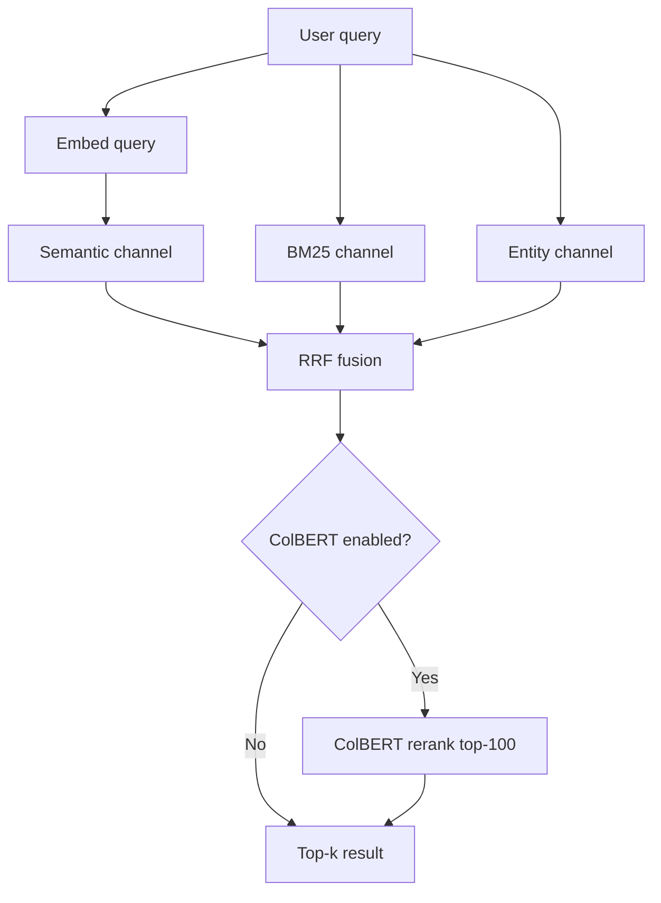
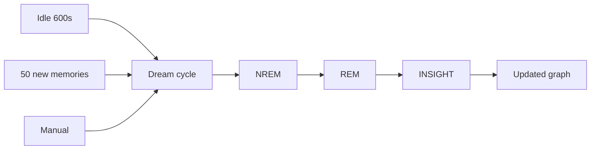

# Architecture

A complete tour of what runs inside Mazemaker, from the embedding model up
through the dream engine and out to the MCP surface. Read this if you want to
understand *why* the system produces the numbers it produces — not just what
the numbers are.

> **For numbers only:** see [`benchmarks.md`](benchmarks.md).
> **For configuration knobs:** see [`configuration.md`](configuration.md).
> **For the dream cycle in detail:** see [`dream-engine.md`](dream-engine.md).

---

## Table of contents

1. [The six-layer cognition stack](#the-six-layer-cognition-stack)
2. [Three integration shapes](#three-integration-shapes)
3. [Storage layer](#storage-layer)
4. [Embedding backends](#embedding-backends)
5. [Retrieval pipeline](#retrieval-pipeline)
6. [GPU recall engine](#gpu-recall-engine)
7. [Graph & spreading activation](#graph--spreading-activation)
8. [Conflict detection & supersession](#conflict-detection--supersession)
9. [Data flow diagrams](#data-flow-diagrams)
10. [SQLite schema](#sqlite-schema)
11. [Runtime file layout](#runtime-file-layout)

---

## The six-layer cognition stack

Most memory systems are one layer — cosine similarity over a vector store.
Mazemaker is six.

| #  | Layer                                | Community | Pro |
|----|--------------------------------------|:---------:|:---:|
| 1  | **Sponge ingestion**                 | ✅        | ✅  |
| 2  | **Atomic Fact Extraction (AFE)**     | ❌        | ✅  |
| 3  | **Embedding — semantic + ColBERT + DAE** | ✅ (partial) | ✅  |
| 4  | **Three-phase dream consolidation**  | ✅ (NREM only) | ✅  |
| 5  | **Synthesis crystallization (Stage S)** | ❌    | ✅  |
| 6  | **Targeted re-formation**            | ❌        | ✅  |

### Layer 1 — Sponge ingestion

Every conversation turn is absorbed by a background thread. Session-end fact
extraction stores **durable decisions and preferences only**, not raw
transcripts. Conflict detection runs at write time so stale facts are
superseded immediately rather than accumulating.

```text
turn → sponge worker → session-end extract → conflict gate → store
```

### Layer 2 — Atomic Fact Extraction (AFE)

Four sub-stages that turn raw session content into the searchable corpus.

- **Stage A** — extract atomic facts from markdown structure (headings, list
  items, code blocks).
- **Stage B** — spaCy NER over the raw text. Pulls named entities, dates,
  amounts.
- **Stage C** — one local LLM call per session targeting **user-state facts**
  (`user prefers X`, `user owns Y`, `user X is Z`). Sub-1B model by default
  (qwen2.5:3b or smollm3); the prompt is the load-bearing piece, not the model.
- **Stage S** — synthesis crystallization during dream cycles. LLM-distilled,
  selective (~10% yield by design). Creates new memories from clusters of
  related facts without flooding the corpus.

The bulk-write refactor (2026-05-12) collapsed per-fact `remember()` calls
into a single bulk embed + `executemany` INSERT + one commit per cycle.
**88 min → 75 s on 500 sources, a 70× speedup.**

### Layer 3 — Embedding (semantic + late-interaction + graph-aware)

Three fused channels:

- **BGE-M3** (1024-d, multilingual) — the primary semantic embedding. Pulled
  via FastEmbed ONNX runtime; no PyTorch conflict, works on CPU.
- **ColBERT@1.5** — late-interaction reranking. Per-token contextual
  embeddings (top-32 per memory cached as a `colbert_tokens` BLOB,
  ~64 KB/row). Rescores the top-100 fused candidates with max-sim. **Drops
  R@5 by 13 pp if disabled** — load-bearing.
- **DAE (Dream-Augmented Embeddings)** — a second embedding built during the
  NREM phase that weights toward graph neighbours. Smooths the embedding
  space along consolidated edges. Wired through PostgresStore end-to-end as
  of 2026-05-14 (was silently disabled on PG before that).

The three channels fuse via **Reciprocal Rank Fusion (RRF)**.

### Layer 4 — Three-phase dream consolidation

Biological-sleep inspired. See [`dream-engine.md`](dream-engine.md) for the
full deep-dive.

- **NREM** — strengthen activated edges, prune weak ones. Personalized
  PageRank on GPU when CUDA is present.
- **REM** — discover bridge memories between isolated clusters.
- **Insight** — Louvain community detection + materialize `derived:cluster`
  summary memories.

The community engine ships NREM. REM + Insight ship in Pro.

### Layer 5 — Synthesis crystallization (Stage S)

LLM-distilled summarization during the dream cycle. Takes a cluster of
related per-session facts (e.g., 27 facts mentioning "Italian food") and
emits 3–5 high-confidence pattern memories (e.g., "user is a fan of
Italian cuisine"). The ~10 % yield is **deliberate** — at higher yield,
naive canonicalization regresses recall because canonical content
out-ranks per-session golds without covering their session IDs.

### Layer 6 — Targeted re-formation

The lever that broke the R@5 = 0.7404 retrieval-tuning ceiling. The
methodology:

1. Run the bench, identify per-question-type queries whose gold session
   isn't in top-5.
2. Pull session content for the missing sessions.
3. Run gpt-5-nano (or your local sub-1B) with a **query-conditional**
   Stage-C prompt that tells the model what the user is asking about.
4. Embed via the shared embed-server, insert at `salience=2.0` with a
   namespace per round.
5. Re-bench with the same retrieval stack.

~$0.07 in API spend on 460 nano calls lifted **ssp R@5 0.3667 → 0.7000
(+33 pp), ssu R@5 0.6406 → 0.9375 (+30 pp), tr R@5 0.6535 → 0.7874 (+13 pp)**.

---

## Three integration shapes

One core engine, three ways to consume it.

```
┌────────────────────────────────────────────────────┐
│ python/mazemaker.py    ← Mazemaker class           │
│ python/memory_client.py ← SQLiteStore / NeuralMem  │
│ python/postgres_store.py ← Postgres + pgvector     │
│ python/embed_provider.py ← FastEmbed / st / hash   │
│ python/gpu_recall.py    ← CUDA cosine engine       │
│ python/dream_engine.py  ← NREM / REM / Insight     │
└────────────────────────────────────────────────────┘
              ▲             ▲             ▲
              │             │             │
   ┌──────────┴──┐ ┌────────┴───┐ ┌───────┴──────┐
   │ MCP server  │ │ Hermes     │ │ Standalone   │
   │ (wonderland │ │ plugin     │ │ Python lib   │
   │  daemon)    │ │ (__init__) │ │ (`import     │
   │ 127.0.0.1:  │ │            │ │  mazemaker`) │
   │  8765       │ │            │ │              │
   └─────────────┘ └────────────┘ └──────────────┘
```

- **MCP server** — what every Claude Code, Cursor, Cline, Continue install
  talks to. Loopback only.
- **Hermes plugin** — for Hermes Agent users. Drops into
  `~/.hermes/hermes-agent/plugins/memory/neural/` via `install.sh`.
- **Standalone library** — `from mazemaker import Mazemaker` for your own
  scripts and notebooks.

---

## Storage layer

**SQLite WAL** is the source of truth for the community engine and ships
with everything. Always works, no external DB needed.

**Postgres + pgvector** is the primary backend for Pro/Enterprise. Flip via
`MM_DB_BACKEND=postgres` + supply `MM_POSTGRES_DSN` (or discrete
`MM_POSTGRES_*` vars). Required for shared multi-agent deployments,
optional otherwise.

Why Postgres for Pro (decision_postgres_for_pro):
- SQLite serializes writes — the dream worker fights for the lock at scale.
- MsSQL escalates licensing complexity.
- pgvector is the only viable open primary that gives concurrent writers
  + ANN indexes + the operational tooling we need.

---

## Embedding backends

Auto-priority list. Falls back transparently.

| Priority | Backend                | Model                                | Speed   | Requirements           |
|----------|------------------------|--------------------------------------|---------|------------------------|
| 1st      | FastEmbed              | intfloat/multilingual-e5-large (1024-d) | ~50 ms  | `pip install fastembed` |
| 2nd      | sentence-transformers  | BAAI/bge-m3 (1024-d)                 | ~200 ms | GPU recommended         |
| 3rd      | tfidf                  | —                                    | varies  | numpy only              |
| 4th      | hash                   | —                                    | instant | nothing                 |

**FastEmbed uses ONNX runtime** — no PyTorch conflict, works on CPU. The
default for community installs.

**Shared embed-server** — the first process to need embeddings spawns a Unix
socket server at `~/.mazemaker/engine/embed.sock` holding the loaded model.
Every other process connects as a client and reuses the same model. One
model instance across all sessions. Auto-ejects GPU → CPU after idle timeout.

> **Watch out:** `fast_runner --max-parallel N` (N > 1) races on the socket;
> only one process wins the bind. The bench orchestrator runs convs
> sequentially by default. Override the path with `MM_EMBED_SOCK_PATH=...`
> if you need per-process sockets.

---

## Retrieval pipeline

Six channels, fused via Reciprocal Rank Fusion.

1. **Semantic** — BGE-M3 cosine over the in-memory matrix (GPU when present).
2. **BM25** — full-text search via SQLite FTS5 or Postgres `tsvector`.
3. **Entity** — named-entity grounding from spaCy.
4. **Temporal** — recency weighting. Honors `last_accessed` and `created_at`.
5. **PPR (Personalized PageRank)** — graph-traversal channel. **The
   biggest MRR contributor** (-0.13 MRR if removed).
6. **ColBERT@1.5** — opt-in late-interaction rerank via `MM_COLBERT_ENABLED=1`.

Six presets, picked via `retrieval_mode`:

| Mode       | Channels active                            | Use when                                     |
|------------|--------------------------------------------|----------------------------------------------|
| `semantic` | semantic only                              | Lowest latency, no hybrid fusion needed      |
| `hybrid`   | semantic + BM25                            | Add lexical recall                           |
| `advanced` | semantic + BM25 + entity                   | + named-entity grounding                     |
| `skynet`   | all six channels                           | Default; over-channeled per benchmark        |
| **`lean`** | semantic + entity + PPR                    | **Recommended** — drops dead-weight channels |
| `trim`     | semantic + BM25 + entity + temporal + PPR  | Conservative middle (drops only salience)    |

`lean` won out on real-text n=200 by +0.18 R@5 over `skynet` and is 4×
faster on synthetic. See [`benchmarks.md`](benchmarks.md#channel-ablation)
for the full ablation.

---

## GPU recall engine

`python/gpu_recall.py`. Loads all embeddings into an in-memory CUDA tensor,
does `torch.matmul(query, corpus.T)` for batch cosine similarity. ~100 ms
for 10 k memories vs ~500 ms on CPU.

```python
from gpu_recall import GPURecall
engine = GPURecall()
results = engine.recall(query_embedding, all_embeddings, top_k=10)
```

**Auto-detects CUDA.** Falls back to Python/numpy if no GPU.

The GPU cache lives at `~/.mazemaker/engine/gpu_cache/` as
`embeddings.npy` + `metadata.pkl`. Rebuilt on demand; per-DB
fingerprinted to avoid cross-DB contamination
(bug:gpu-cache-cross-db, patched).

---

## Graph & spreading activation

Two engines, configurable via `think_engine`:

- **BFS** — breadth-first search over connections with a decay factor.
  Cheap, deterministic.
- **PPR (Personalized PageRank)** — random-walk with restart. The
  load-bearing channel for ranking quality. **GPU-accelerated** via
  `torch.sparse.mm` on a row-stochastic adjacency tensor cached on
  CUDA. ~6.6 ms per seed on RTX-class hardware.

`Mazemaker.think_ids(start_id, k=20)` is the fast path — returns only the
top-k activated node IDs, skipping label resolution and SQL round-trips.
NREM uses this; `Mazemaker.think()` retains the label-resolved dict for
the MCP `mazemaker_think` tool and the Architect dashboard.

---

## Conflict detection & supersession

Every `remember()` call runs cosine similarity against recent memories and
calls `_detect_conflicts()`. Conflicting memories are either fused (when
similarity is very high) or marked `[SUPERSEDED]` and pointed to the
new revision via `memory_revisions`.

The `detect_conflicts=False` control arm in the benchmark suite proves
this is doing real work: turn it off and winner@1 drops from **0.33 to
0.03**.

---

## Data flow diagrams

### Remember path



### Recall path



### Dream cycle

See [`dream-engine.md`](dream-engine.md) for the full version.



---

## SQLite schema

```sql
-- Core
memories            (id, content, embedding, label, category, salience,
                     last_accessed, access_count, created_at, ...)
connections         (source_id, target_id, weight, edge_type, created_at)
connection_history  (source_id, target_id, last_weight, last_updated)
memory_revisions    (id, memory_id, prev_content, reason, created_at)

-- Dream engine
dream_sessions      (id, phase, started_at, finished_at, stats_json)
dream_insights      (id, session_id, type, data_json)

-- ColBERT (opt-in)
-- colbert_tokens BLOB lives on the memories table as a column

-- DAE (Pro)
memory_dae_embeddings (memory_id, dae_vector BYTEA, updated_at)

-- FTS5
memories_fts        (content)  -- virtual table, mirrors memories.content

-- Indexes
idx_memories_label              ON memories(label)
idx_memories_category           ON memories(category)
idx_connections_source          ON connections(source_id)
idx_connections_target          ON connections(target_id)
idx_dream_sessions_phase        ON dream_sessions(phase, started_at)
```

Postgres schema mirrors this with `pgvector` for the embedding column,
`BYTEA` for the DAE blob, and `tsvector` for the FTS replacement.

---

## Runtime file layout

```
~/.mazemaker/engine/
├── memory.db                  SQLite source of truth (or PG pointer)
├── embed.sock                 Shared embed-server UNIX socket
├── models/                    Auto-downloaded embedding model (~2.2 GB)
├── gpu_cache/
│   ├── embeddings.npy         Per-DB-fingerprinted CUDA cache
│   └── metadata.pkl
├── access_logs/               JSONL recall event log
└── license.jwt                Ed25519-signed license (Pro/Enterprise)

~/.hermes/
└── config.yaml                Provider + neural config
```

All paths live on **your machine**. The hosted backend at
`api.mazemaker.dev` never sees memory content — only the license JWT and
quota counter. See [`topology.md`](https://mazemaker.online/topology/) on
the marketing site for the full four-domain story.

---

## Going deeper

- **Dream cycle internals** — [`dream-engine.md`](dream-engine.md)
- **Every config knob** — [`configuration.md`](configuration.md)
- **MCP tool surface** — [`mcp-tools.md`](mcp-tools.md)
- **Benchmark suite + audit** — [`benchmarks.md`](benchmarks.md)
- **What's new in the Beta** — [`changelog-beta.md`](changelog-beta.md)
