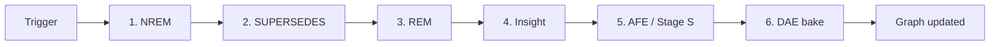

# Dream Engine

Autonomous background memory consolidation, inspired by biological sleep.
Mazemaker runs three dream phases in sequence — NREM, REM, Insight — plus
two Pro-only formation phases (SUPERSEDES, AFE, Stage S synthesis) that
turn raw memories into a living cognitive graph.

> **Why a dream engine at all?** Because retrieval over a flat vector store
> degrades as the corpus grows. The dream cycle reshapes the corpus
> *between* recall calls: strengthens useful paths, prunes dead structure,
> bridges isolated memories, materializes summaries, crystallizes
> preferences. The benchmark numbers stop climbing without it.

---

## Table of contents

1. [The five phases](#the-five-phases)
2. [Triggers](#triggers)
3. [Sampling — beating the surface trap](#sampling--beating-the-surface-trap)
4. [GPU acceleration](#gpu-acceleration)
5. [Standalone daemon — `dream_worker.py`](#standalone-daemon--dream_workerpy)
6. [Live cycle numbers](#live-cycle-numbers)
7. [Observability](#observability)
8. [Tuning knobs](#tuning-knobs)

---

## The five phases



### 1. NREM — strengthen + prune *(community + Pro)*

The bread-and-butter phase. For each sampled seed memory:

- Spreading activation (PPR on GPU when available) finds the related
  cluster.
- Connections **inside the activated cluster** gain weight (+0.05).
- Connections **outside** lose weight (-0.01).
- Connections below threshold (`weight < 0.05`) are **pruned**.

Net effect: the corpus topology drifts toward what's actually being used,
without operator intervention.

### 2. SUPERSEDES — conflict resolution *(Pro)*

Looks for pairs of memories that are semantically similar (cos ≥ 0.85) but
contradict on a specific attribute. Marks the older one `[SUPERSEDED]`
and records the revision chain in `memory_revisions`.

### 3. REM — bridge discovery *(Pro)*

Samples up to 800 isolated memories per cycle. For each, runs a batched
recall against the consolidated graph to find semantically related
memories *that aren't already connected*. New edges are written with
`edge_type='bridge'` at `weight = similarity × 0.3`.

REM is the phase that breaks isolated clusters open. Without it, the
graph stays a forest of disconnected sessions.

> **FK guard (2026-05-17).** Bridge candidates can come from the GPU
> cache after NREM pruned the underlying memory. Every bridge write now
> anti-joins against `memories` on both endpoints, so one stale ID can't
> abort the whole REM batch. See
> [`bug:rem-fk-violation-stale-gpu-ids`](changelog-beta.md#patched-bugs).

### 4. Insight — community materialization *(Pro)*

Louvain community detection over the full consolidated graph. For each
strongly-connected community of size ≥ 4, emits a synthetic
`derived:cluster` summary memory that captures the cluster's centroid
content. These derived memories themselves participate in subsequent
recalls.

> **The `self.backend` typo (2026-05-16).** Insight was silently emitting
> zero memories for two days because of a one-character bug
> (`self.backend` instead of `self._backend`). All dream-phase exception
> handlers are now `logger.warning(..., exc_info=True)` instead of
> `logger.debug(...)` so silent-kill chains surface. See
> [`bug:dream-engine-self-backend-typo`](changelog-beta.md#patched-bugs).

### 5. AFE / Stage S — formation crystallization *(Pro)*

Two sub-phases that turn raw session content into atomic facts and
synthesized abstractions:

- **AFE** (Atomic Fact Extraction) runs Stage A (markdown) + Stage B
  (NER) + **Stage C** (one local LLM call per session, user-state focus)
  per source memory.
- **Stage S synthesis** clusters Stage C outputs by embedding cos ≥ 0.85
  and LLM-distills the cluster centroid into a single high-confidence
  pattern memory (~10% yield, deliberately selective).

The bulk-write refactor: **88 min → 75 s on 500 sources**. Single bulk
embed call + single `executemany` INSERT + single commit per cycle.

### 6. DAE bake — graph-aware embedding *(Pro)*

Runs LAST in the cycle so the neighbour graph it averages over is the
freshly-consolidated one. Full-corpus pass — every memory's DAE vector is
the salience-weighted mean of its graph neighbours' BGE-M3 embeddings.

Cadence-gated via `MM_DAE_RECOMPUTE_EVERY` (default 5). Skipped silently
for community / non-Pro installs.

---

## Triggers

- **Automatic — idle.** After `idle_threshold` seconds with no `pre_llm_call`
  hook firing. Default 600 s.
- **Automatic — write count.** Every `memory_threshold` new memories
  stored. Default 50.
- **Manual.** Via the `mazemaker_dream` MCP tool.
- **Standalone.** `python python/dream_worker.py --daemon` — no idle gating.

The in-pod loop pauses on every Hermes `pre_llm_call` hook and resumes on
`post_llm_call` if it was running. This keeps the dream from fighting
your interactive LLM for compute. On large corpora the standalone daemon
is the better pattern — see below.

---

## Sampling — beating the surface trap

NREM and REM used to pull `LIMIT N ORDER BY created_at DESC` — the most
recent slice only. On a 100 k+ corpus that recycles the same surface
forever: old memories never get replayed, never get re-strengthened,
quietly decay below the prune threshold.

Both phases now sample via a **three-slice mix** on `DreamBackend`:

```python
sample_for_dream(
    limit,
    recent_pct=0.5,        # 50% most recent (created_at DESC)
    random_old_pct=0.3,    # 30% random across the whole table
    low_salience_pct=0.2,  # 20% lowest-salience (rescue slice)
)
```

The random slice is the one that **breaks the surface trap** — it pulls
evenly from the whole corpus, so every memory has a non-zero replay
chance every cycle regardless of age.

`sample_isolated_for_dream` is the REM variant — same mix, constrained
to memories with fewer than `max_connections` edges so REM stays focused
on bridging orphans.

**Insight is unchanged.** It already operates on the full edge graph
without a time bias.

On much larger corpora (>500 k), bump the random slice:

```python
DreamEngine(
    sample_random_pct=0.5,
    max_memories_per_cycle=4000,
)
```

---

## GPU acceleration

When CUDA is available (`GpuRecallEngine` loaded), every CPU-bypassable
hot path moves to the GPU. CPU paths remain as fallbacks — non-CUDA
installs see no behaviour change beyond raw speed.

### NREM — Personalized PageRank on GPU

- `_build_gpu_ppr_adjacency()` loads `connections WHERE weight > 0` once
  and uploads a row-stochastic `sparse_coo_tensor` to CUDA. ~700 ms for
  a 1 M-edge corpus.
- `_ppr_top_ids_gpu(seed, k)` — N rounds of
  `alpha*personalization + (1-α) * A @ p` via `torch.sparse.mm`, then
  `torch.topk(p, k)` on the GPU. Only k IDs cross back to the CPU.
  ~6.6 ms per seed on RTX-class CUDA.
- `Mazemaker.think_ids(start_id, k=20)` is the public fast path —
  returns only the top-k activated node IDs, no label resolution.

Adjacency cache rebuilds every `_ppr_rebuild_every` NREM phases
(default 10). Stale weights between rebuilds are acceptable because PPR
is an approximation anyway.

### REM — batched recall + bulk bridge writes

- `GpuRecallEngine.recall_batch(queries, k)` collapses N sequential
  per-query embed-server round-trips into one `embed_batch` call, one
  matmul `(B, dim) × (dim, N_corpus).T`, one `topk` along the batch axis.
- `DreamBackend.add_bridges_batch(bridges, ...)` writes all candidates in
  a single transaction. SQLite override stages bridges in a temp table,
  diffs against `connections` in one `EXISTS` query, `executemany`-INSERTs
  the truly-new rows, one commit. **~6000 commits/cycle → 1.**

### Insight — transitive benefit

Already global. Benefits transitively from richer NREM/REM graphs.

---

## Standalone daemon — `dream_worker.py`

The default in-pod dream loop pauses on every Hermes `pre_llm_call` hook
and shares the SQLite write lock with `mazemaker_remember` calls. On a
100 k+ corpus that's brittle: a NREM cycle with
`max_memories_per_cycle=2000` can exceed the 600 s idle window, the loop
fires a duplicate cycle, and both end up `finished_at IS NULL` orphans
fighting for the write lock.

`python/dream_worker.py` is a standalone runner that bypasses all that.
Continuous loop, no idle gating, drives `_run_dream_cycle()` directly,
runs as its own host process with full GPU access.

### Setup

```fish
# 1. Disable in-pod engine for this session (ephemeral — clears on reboot)
systemctl --user edit --runtime mazemaker-mcp.service
# add:  [Service]
#       Environment="MM_DREAM_DISABLED=1"
systemctl --user daemon-reload && systemctl --user restart mazemaker-mcp.service

# 2. Run the standalone daemon
cd ~/projects/mazemaker/python
python dream_worker.py --max-memories 2000 --max-isolated 800
```

Both daemons write to the same `dream_sessions` / `connection_history` /
`dream_insights` tables, so `mazemaker_dream_stats` reflects whichever
loop is active without distinguishing.

### Flags

```text
--daemon              Loop forever (default: one cycle then exit)
--once                Single cycle then exit (alias)
--phase nrem          Run a single phase (nrem|supersedes|rem|insight|afe|dae)
--max-memories N      NREM batch size (default 2000)
--max-isolated N      REM batch size (default 800)
--cycle-interval N    Seconds between cycles (default 5)
--no-think            Skip self._memory.think() in NREM (faster, less consolidation)
--backend postgres    Force a backend (overrides MM_DB_BACKEND)
```

After a reboot the `/run` drop-in clears and the in-pod engine
auto-re-enables — no manual cleanup needed.

---

## Live cycle numbers

193 k memories, ~1 M edges, RTX-class CUDA, default knobs:

| Phase     | Initial (CPU) | Post-PPR-GPU | Post-batched-REM | Post-`think_ids` |
|-----------|---------------|--------------|------------------|------------------|
| NREM      | never finished| 50 s         | 145–190 s        | **~16 s**        |
| REM       | 6 min         | 6 min        | 42 s             | **~12 s**        |
| Insight   | 60 s          | 60 s         | 2 s              | **~2 s**         |
| **Total** | never         | 470 s        | 200 s            | **~38 s**        |

That's ~95 cycles/h on the RTX setup. Every ~2 hours the entire
193 k-memory corpus has been touched at least once via the random-old
slice of the sampler.

---

## Observability

### `mazemaker_dream_stats`

The MCP tool that returns dream telemetry. Sample output:

```json
{
  "dream_sessions": {"total": 142, "finished": 142},
  "phases": {
    "nrem": {"latest": "2026-05-19T03:12:44Z", "memories_processed": 1842, "edges_strengthened": 304},
    "rem":  {"latest": "2026-05-19T03:13:01Z", "isolated_processed": 600, "bridges_added": 47},
    "insight": {"latest": "2026-05-19T03:13:08Z", "communities": 12, "insights_emitted": 12}
  }
}
```

### PG diagnostic query

When a dream cycle goes silent (CPU + GPU both idle):

```sql
SELECT pid, state, wait_event_type, wait_event,
       now() - query_start AS dur,
       substring(query, 1, 120)
FROM pg_stat_activity
WHERE datname = current_database()
  AND state != 'idle'
ORDER BY dur DESC NULLS LAST
LIMIT 10;
```

Anything > 30 s is suspect. Anything > 5 min must be cancelled and
root-caused. `cancel_backend(pid)` aborts the runaway without killing the
Python process.

### Forward-check before launching

Per the [verify-forward operator rule](production-lessons.md#verify-forward-not-after):

```bash
# Did GPU recall arm? If this is missing 3 min after init, you're on CPU.
journalctl --user -u mazemaker-mcp.service | grep "GPU recall ARMED"

# Did the cycle produce edges? Confirm non-zero before declaring success.
psql -c "SELECT count(*) FROM connections WHERE edge_type='bridge'"
```

---

## Tuning knobs

All on the `DreamEngine` constructor (and most surfaced as env vars).

| Knob                            | Default | What it does                                 |
|---------------------------------|---------|----------------------------------------------|
| `max_memories_per_cycle`        | 2000    | NREM batch size per cycle                    |
| `max_isolated_per_cycle`        | 800     | REM batch size per cycle                     |
| `sample_recent_pct`             | 0.5     | Three-slice mix: recent                      |
| `sample_random_pct`             | 0.3     | Three-slice mix: random old (anti-decay)     |
| `sample_low_salience_pct`       | 0.2     | Three-slice mix: rescue slice                |
| `_ppr_rebuild_every`            | 10      | NREM cycles between GPU adjacency rebuilds   |
| `_dae_recompute_every`          | 5       | NREM cycles between DAE full-corpus bakes    |
| `nrem_strengthen_delta`         | 0.05    | Edge weight added on activation              |
| `nrem_weaken_delta`             | 0.01    | Edge weight subtracted off activation        |
| `prune_threshold`               | 0.05    | Edge weight below this gets pruned           |
| `rem_bridge_weight_factor`      | 0.3     | `bridge_weight = similarity × this`          |
| `insight_min_community_size`    | 4       | Communities smaller than this are skipped    |
| `insight_max_clusters_per_cycle`| 50      | Cap on `derived:cluster` memories per cycle  |

> **Defaults assume ~5-min idle cycle window and ~50–200 ms per
> embedding think operation.** On smaller corpora (< 5 k) the defaults
> are oversized but harmless — NREM just touches more of the table than
> strictly needed. On much larger corpora (> 500 k), bump
> `sample_random_pct=0.5` so each cycle samples a non-trivial fraction.

---

## Going deeper

- **Engine architecture** — [`architecture.md`](architecture.md)
- **All env vars + YAML knobs** — [`configuration.md`](configuration.md)
- **What the dream cycle gave back to retrieval** — [`benchmarks.md`](benchmarks.md)
- **Patched bugs (FK guard, self.backend typo, NOT EXISTS rewrite)** —
  [`changelog-beta.md`](changelog-beta.md#patched-bugs)
